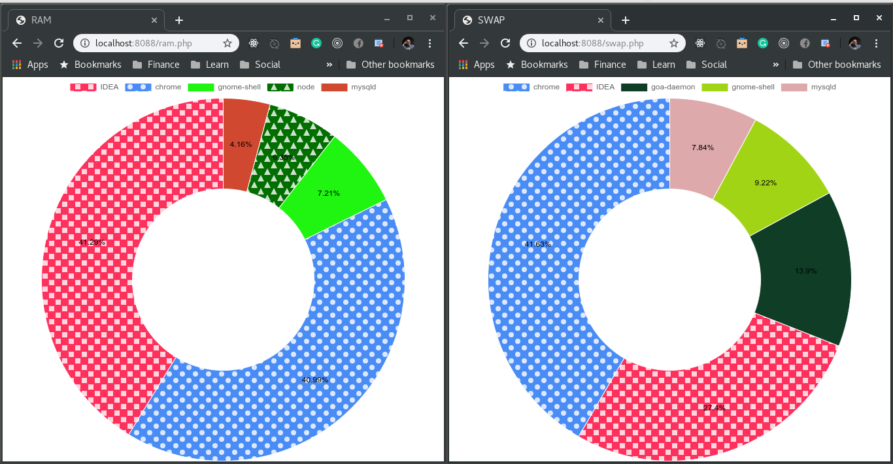

Linux Resource Usage Monitor with Web-based GUI and charts

---

It groups processes by command (without parameters).

Also, it assumes that any `java` process is JetBrains IDEA (that was my case).



## Getting started
Run local php server: 
```bash
php -S 127.0.0.1:8080
```

View RAM usage (RSS): `http://127.0.0.1:8080/ram.php`

View SWAP usage: `http://127.0.0.1:8080/swap.php`
